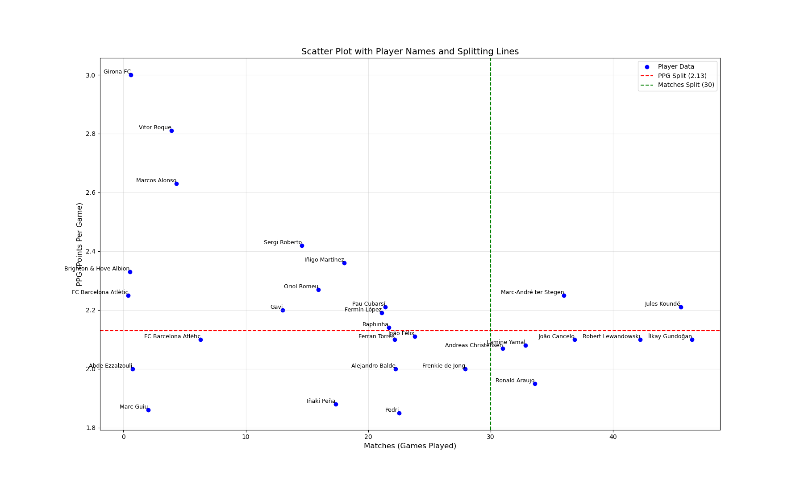

# football_data
统计一些足球数据

## 爬取足球赛录像

football_game.py

## 计算球员赛季正负值

足球引入正负值的概念，参考视频：<https://www.bilibili.com/video/BV1kYBBYEEW7/>

football_data.py是对视频中计算方法的实现，首先爬取指定网页的表格数据，然后进行可视化。巴塞罗那23/24赛季球员正负值展示如下：

